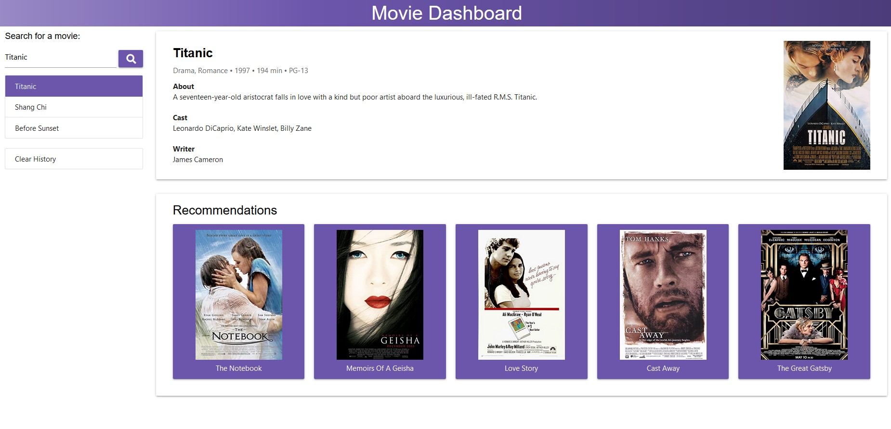

# Movie Dashboard

## Purpose
A web application that allows users to search for a movie and retrieve its information such as genre, release year, run time, rating, description, cast, writer and movie poster.  Recommendations to similar movies are also provided.  Movies that users had previously looked up will be saved in the browser's local storage.

## Website
https://asharkwithlazerbeams.github.io/Project-1/

## Built With
* HTML
* CSS
* Materialize CSS
* JavaScript
* jQuery
* The Open Movie Database (OMDb) API
* TasteDive API

## Contribution
Made with ❤️ by Antonio Anaya Tapia, Deleon Haley, Joshua Ramat, Lei Zhang, Te Wei
